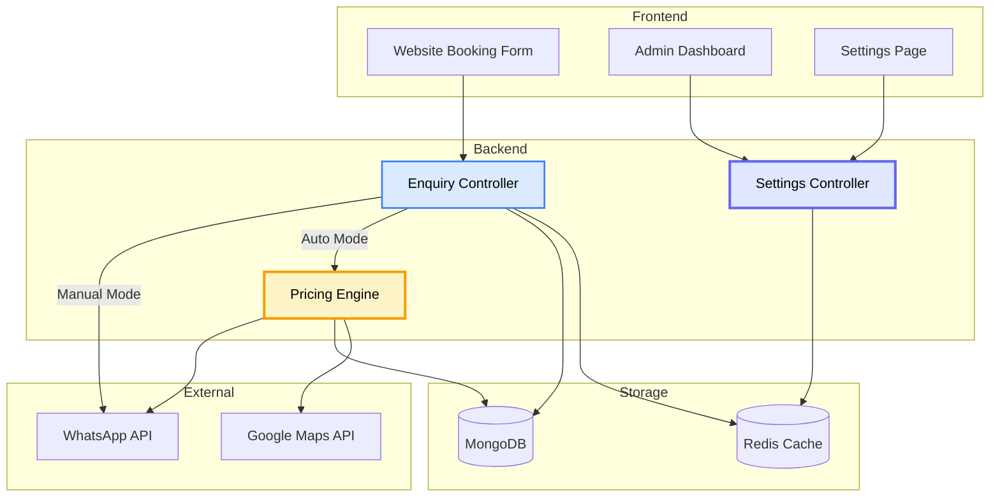
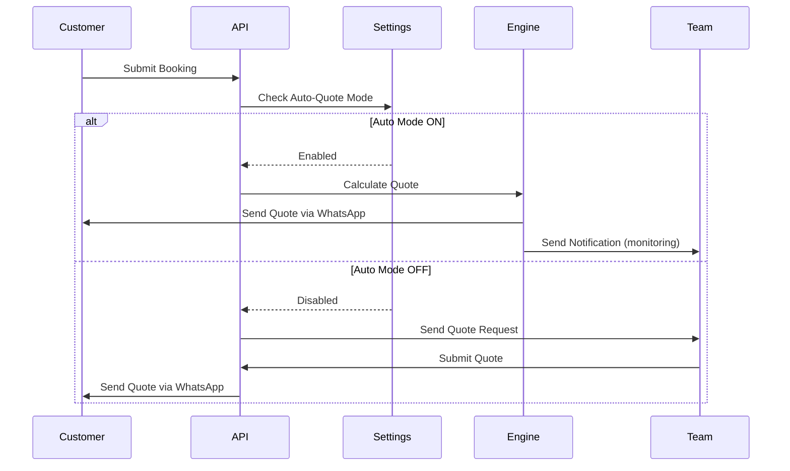

# 🤖 Auto-Quote Mode Implementation Summary

## Overview

Successfully implemented a **dual-mode quote system** that allows the JT Chauffeur platform to operate in either:
- **Auto Mode**: Automatically calculate and send quotes to customers
- **Manual Mode**: Require pricing team approval for all quotes

---

## Architecture Diagram



---

## Files Modified

### Backend Files

1. **`backend/src/controllers/enquiryController.js`**
   - Added auto-quote mode detection
   - Implemented automatic quote calculation
   - Added customer notification via WhatsApp
   - Added pricing team monitoring notifications
   - Implemented fallback to manual mode on errors
   - Created `notifyPricingTeamManual()` helper function

2. **`backend/src/controllers/settingsController.js`**
   - Added `autoQuoteMode` to default settings
   - Reads from `AUTO_QUOTE_MODE` environment variable

3. **`backend/.env.example`**
   - Added `AUTO_QUOTE_MODE` configuration option
   - Added documentation comments

4. **`backend/.env`**
   - Added `AUTO_QUOTE_MODE=false` (default)

### Frontend Files

5. **`admin-settings.html`**
   - Added Auto-Quote Mode toggle UI
   - Yellow highlighted section with robot icon
   - Toggle switch with ON/OFF status indicator
   - Explanatory text for both modes

6. **`admin-settings.js`**
   - Added toggle event listener
   - Added visual status updates (ON/OFF)
   - Added auto-quote mode to settings save/load

### Documentation Files

7. **`AUTO_QUOTE_MODE_GUIDE.md`** (NEW)
   - Comprehensive guide with diagrams
   - Configuration instructions
   - Feature explanations
   - Best practices
   - Troubleshooting guide

8. **`QUICK_START_AUTO_QUOTE.md`** (NEW)
   - Quick start guide with diagrams
   - Step-by-step setup instructions
   - Testing procedures
   - Example messages

9. **`AUTO_QUOTE_IMPLEMENTATION_SUMMARY.md`** (THIS FILE)
   - Implementation summary
   - Files changed
   - Features added

---

## Key Features Implemented

### ✅ Automatic Quote Calculation

- Google Maps distance/duration
- Zone detection (airports, ULEZ, congestion)
- Time multipliers (peak/off-peak)
- Vehicle type pricing
- Complete breakdown stored in database

### ✅ Dual Mode Operation

- **Auto Mode**: Instant quotes to customers
- **Manual Mode**: Team review required
- Easy toggle in admin dashboard
- Environment variable override

### ✅ Customer Communication

- Instant WhatsApp quote delivery
- Detailed breakdown included
- Quote validity period
- Clear call-to-action

### ✅ Team Monitoring

- Notifications for all auto-quotes
- Full quote details
- Ability to modify/override
- Dashboard visibility

### ✅ Safety & Fallback

- Automatic fallback to manual on errors
- Error logging
- Manual override capability
- Quote modification before customer accepts

---

## Configuration Options

### Environment Variable

```bash
# In backend/.env
AUTO_QUOTE_MODE=true   # Enable auto-quote
AUTO_QUOTE_MODE=false  # Disable (manual mode)
```

### Admin Dashboard

1. Login to admin dashboard
2. Click "Settings"
3. Toggle "Auto-Quote Mode"
4. Click "Save Changes"

**Note**: Dashboard settings override environment variable

---

## How It Works



---

## Testing Checklist

- [x] Auto-quote mode toggle in admin dashboard
- [x] Settings save/load from Redis
- [x] Environment variable fallback
- [x] Quote calculation with all components
- [x] Customer WhatsApp notification
- [x] Team monitoring notification
- [x] Error handling and fallback
- [x] Quote storage in database
- [x] Dashboard display of quotes

---

## Next Steps

1. **Test in Production**
   - Start with manual mode
   - Test auto-quote with sample bookings
   - Monitor first few auto-quotes
   - Gradually enable for all bookings

2. **Monitor Performance**
   - Track auto-quote success rate
   - Monitor customer acceptance rate
   - Review quote accuracy
   - Adjust pricing rules as needed

3. **Future Enhancements**
   - Per-enquiry auto/manual toggle
   - Confidence score for auto-quotes
   - Machine learning optimization
   - A/B testing capabilities

---

## Support & Documentation

- **Quick Start**: `QUICK_START_AUTO_QUOTE.md`
- **Full Guide**: `AUTO_QUOTE_MODE_GUIDE.md`
- **Logs**: `backend/logs/combined.log`
- **Admin Dashboard**: Settings → Auto-Quote Mode

---

**Implementation Date**: January 2026  
**Status**: ✅ Complete and Ready for Testing

