# 🚀 Quick Start: Auto-Quote Mode

## System Architecture


---

## Enable Auto-Quote Mode (2 Ways)

### Method 1: Admin Dashboard (Recommended)

```mermaid
sequenceDiagram
    participant Admin
    participant Dashboard
    participant API
    participant Redis
    participant System

    Admin->>Dashboard: Login
    Dashboard->>API: Authenticate
    API-->>Dashboard: ✅ Token

    Admin->>Dashboard: Click Settings
    Dashboard->>API: GET /settings
    API->>Redis: Load Settings
    Redis-->>API: Current Settings
    API-->>Dashboard: Display Settings

    Admin->>Dashboard: Toggle Auto-Quote ON
    Admin->>Dashboard: Click Save
    Dashboard->>API: PUT /settings
    API->>Redis: Save AUTO_QUOTE_MODE=true
    Redis-->>API: ✅ Saved
    API-->>Dashboard: ✅ Success
    Dashboard-->>Admin: Settings Updated!

    System->>System: Auto-Quote Now Active 🤖
```



**Steps:**

1. **Login to Admin Dashboard**
   - Go to: `https://your-domain.com/admin-dashboard.html`
   - Login with admin credentials

2. **Navigate to Settings**
   - Click "Settings" button in top right

3. **Toggle Auto-Quote Mode**
   - Find the "Auto-Quote Mode" section (yellow box with robot icon)
   - Click the toggle switch to turn it **ON**
   - Click "Save Changes"

4. **Done!**
   - System will now automatically calculate and send quotes
   - You'll still receive notifications for monitoring

---

### Method 2: Environment Variable

1. **Edit `.env` file**
   ```bash
   cd backend
   nano .env
   ```

2. **Set AUTO_QUOTE_MODE**
   ```bash
   AUTO_QUOTE_MODE=true
   ```

3. **Restart Server**
   ```bash
   npm start
   ```

---

## How It Works

### When Customer Submits Booking:

**Auto Mode ON:**
```
1. Customer fills booking form
2. System calculates quote instantly
3. Quote sent to customer via WhatsApp
4. Pricing team receives notification (for monitoring)
5. Customer can accept/reject quote
```

**Auto Mode OFF (Manual):**
```
1. Customer fills booking form
2. Pricing team receives WhatsApp notification
3. Team reviews and submits quote manually
4. Quote sent to customer
5. Customer can accept/reject quote
```

---

## What Gets Calculated Automatically?

✅ **Base Fare** - Based on vehicle type
✅ **Distance Charge** - £2.50 per km
✅ **Zone Charges** - Airports, ULEZ, Congestion
✅ **Time Multipliers** - Peak/off-peak pricing
✅ **Total Price** - All inclusive

---

## Example Auto-Quote Message

```
✅ Quote Ready - JT-2026-000123

Dear John Smith,

Thank you for your enquiry. Here's your quote:

📍 From: Heathrow Airport, London
📍 To: 10 Downing Street, London
📅 Date: 2026-01-20 at 10:00
🚗 Vehicle: Executive Sedan
👥 Passengers: 2

💰 Total Price: £198.50

📍 Zones: Heathrow Airport, London ULEZ
⏰ Peak Morning pricing
🛣️ Distance: 30.8 km (57 mins)

This quote is valid until 22 Jan 2026, 10:00

Reply "YES" to confirm your booking or contact us for any questions.
```

---

## Monitoring Auto-Quotes

### Pricing Team Notification

You'll receive this for every auto-quote:

```
🤖 AUTO-QUOTE SENT

Ref: JT-2026-000123
Customer: John Smith
Quote: £198.50
From: Heathrow Airport, London
To: 10 Downing Street, London

✅ Quote automatically sent to customer
To modify, use admin dashboard
```

### View in Dashboard

1. Go to Admin Dashboard
2. Click on enquiry reference number
3. See full quote breakdown
4. Modify if needed
5. Resend updated quote

---

## When to Use Each Mode


### Use AUTO Mode ✅

- Standard transfers
- Airport pickups/dropoffs
- City-to-city transfers
- High-volume periods
- 24/7 instant quotes
- Competitive advantage

### Use MANUAL Mode ⚠️

- Multi-stop journeys
- Special events (weddings)
- VIP clients
- Custom requests
- Unusual routes
- Testing new pricing

---

## Safety Features

### Automatic Fallback

If auto-quote fails (e.g., API error), system automatically switches to manual mode for that enquiry.

### Manual Override

You can always:
- View auto-generated quotes
- Modify quotes before customer accepts
- Resend updated quotes
- Switch back to manual mode anytime

---

## Testing Auto-Quote

```mermaid
graph TD
    Start[Start Testing] --> Enable{Enable<br/>Auto Mode}

    Enable -->|Dashboard| D1[Login to Dashboard]
    Enable -->|.env| E1[Edit .env file]

    D1 --> D2[Toggle Auto-Quote ON]
    D2 --> D3[Save Settings]

    E1 --> E2[Set AUTO_QUOTE_MODE=true]
    E2 --> E3[Restart Server]

    D3 --> Test[Submit Test Booking]
    E3 --> Test

    Test --> Check1[Check WhatsApp]
    Check1 --> WA1[✅ Customer Quote]
    Check1 --> WA2[✅ Team Notification]

    Test --> Check2[Check Dashboard]
    Check2 --> Status[✅ Status: Quoted]
    Check2 --> Breakdown[✅ Quote Breakdown]

    WA1 --> Verify{All Checks<br/>Pass?}
    WA2 --> Verify
    Status --> Verify
    Breakdown --> Verify

    Verify -->|YES| Success[🎉 Auto-Quote Working!]
    Verify -->|NO| Debug[Check Logs & Troubleshoot]

    Debug --> Logs[Review Logs]
    Logs --> Fix[Fix Issues]
    Fix --> Test

    style Enable fill:#e0e7ff,stroke:#6366f1,stroke-width:3px,color:#000
    style Success fill:#d1fae5,stroke:#10b981,stroke-width:3px,color:#000
    style Debug fill:#fee2e2,stroke:#ef4444,stroke-width:2px,color:#000
    style Test fill:#fef3c7,stroke:#f59e0b,stroke-width:2px,color:#000
```



**Testing Steps:**

1. **Enable Auto Mode** (via dashboard or .env)
2. **Submit Test Booking** on website
3. **Check WhatsApp** - You should receive:
   - Customer quote message (if you use customer's number)
   - Pricing team notification
4. **Check Admin Dashboard** - Enquiry should show "quoted" status
5. **Review Quote Breakdown** - Click on enquiry to see details

---

## Troubleshooting

### Auto-quotes not sending?

```bash
# Check logs
cd backend
tail -f logs/combined.log | grep "Auto-quote"

# Verify settings
# 1. Check .env file: AUTO_QUOTE_MODE=true
# 2. Check admin dashboard settings
# 3. Restart server
```

### Quotes seem incorrect?

1. Check pricing rules in database
2. Verify zone definitions
3. Test with `/api/v1/quotes/calculate` endpoint
4. Review logs for calculation details

---

## Support

- **Documentation**: See `AUTO_QUOTE_MODE_GUIDE.md` for full details
- **Logs**: `backend/logs/combined.log`
- **Admin Dashboard**: Modify settings anytime
- **Email**: tech@jtchauffeur.com

---

## Next Steps

1. ✅ Enable auto-quote mode
2. ✅ Test with sample booking
3. ✅ Monitor first few quotes
4. ✅ Adjust pricing rules if needed
5. ✅ Enjoy automated quoting! 🎉

