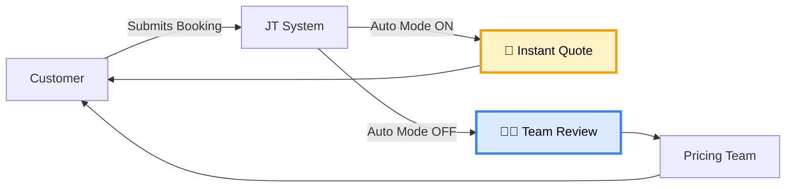

# 🤖 Auto-Quote System - Complete Documentation

## 📚 Table of Contents

1. [Quick Start](#quick-start)
2. [System Overview](#system-overview)
3. [Documentation Files](#documentation-files)
4. [Key Features](#key-features)
5. [Configuration](#configuration)
6. [Diagrams](#diagrams)

---

## Quick Start

### Enable Auto-Quote in 3 Steps

1. **Login to Admin Dashboard**
   ```
   https://your-domain.com/admin-dashboard.html
   ```

2. **Go to Settings → Toggle Auto-Quote Mode ON**

3. **Save Changes** ✅

**That's it!** The system will now automatically calculate and send quotes to customers.

---

## System Overview



### Two Operating Modes

| Mode | Description | Best For |
|------|-------------|----------|
| 🤖 **Auto** | System calculates and sends quotes instantly | Standard transfers, high volume, 24/7 service |
| 👨‍💼 **Manual** | Pricing team reviews before sending | Complex bookings, VIP clients, custom requests |

---

## Documentation Files

### 📖 Available Guides

1. **`QUICK_START_AUTO_QUOTE.md`** ⭐ START HERE
   - Quick setup instructions
   - Step-by-step guide with diagrams
   - Testing procedures
   - Troubleshooting

2. **`AUTO_QUOTE_MODE_GUIDE.md`** 📚 COMPREHENSIVE
   - Complete feature documentation
   - Configuration options
   - Best practices
   - Monitoring & analytics

3. **`AUTO_QUOTE_IMPLEMENTATION_SUMMARY.md`** 🔧 TECHNICAL
   - Implementation details
   - Files modified
   - Architecture diagrams
   - Developer reference

4. **`README_AUTO_QUOTE.md`** 📋 THIS FILE
   - Overview and navigation
   - Quick reference

---

## Key Features

### ✅ Automatic Quote Calculation

- **Distance-based pricing** using Google Maps
- **Zone detection** (airports, ULEZ, congestion)
- **Time multipliers** (peak/off-peak)
- **Vehicle type pricing**
- **Complete breakdown** stored in database

### ✅ Instant Customer Communication

- WhatsApp quote delivery
- Detailed breakdown included
- Quote validity period
- Clear acceptance instructions

### ✅ Team Monitoring

- Notifications for all auto-quotes
- Full quote visibility
- Modification capability
- Dashboard integration

### ✅ Safety & Reliability

- Automatic fallback to manual mode on errors
- Error logging and monitoring
- Manual override at any time
- Quote modification before customer accepts

---

## Configuration

### Method 1: Admin Dashboard (Recommended)

```
Admin Dashboard → Settings → Auto-Quote Mode → Toggle ON → Save
```

### Method 2: Environment Variable

```bash
# In backend/.env
AUTO_QUOTE_MODE=true
```

**Note**: Dashboard settings override environment variable

---

## Diagrams

All documentation includes interactive Mermaid diagrams:

### 🔄 Workflow Diagram
Shows the complete flow from customer booking to quote delivery

### 🏗️ Architecture Diagram
Shows system components and their interactions

### 📊 Calculation Diagram
Shows how quotes are calculated with all pricing components

### 🔀 Fallback Diagram
Shows error handling and fallback mechanisms

### 🧪 Testing Diagram
Shows the testing workflow and verification steps

---

## Quick Reference

### Enable Auto-Quote
```bash
# Via Dashboard
Settings → Auto-Quote Mode → ON

# Via .env
AUTO_QUOTE_MODE=true
```

### Disable Auto-Quote
```bash
# Via Dashboard
Settings → Auto-Quote Mode → OFF

# Via .env
AUTO_QUOTE_MODE=false
```

### Check Status
```bash
# View logs
tail -f backend/logs/combined.log | grep "Auto-quote"

# Check dashboard
Admin Dashboard → Settings → Auto-Quote Mode
```

---

## Support

- 📖 **Quick Start**: `QUICK_START_AUTO_QUOTE.md`
- 📚 **Full Guide**: `AUTO_QUOTE_MODE_GUIDE.md`
- 🔧 **Technical**: `AUTO_QUOTE_IMPLEMENTATION_SUMMARY.md`
- 📝 **Logs**: `backend/logs/combined.log`

---

## Next Steps

1. ✅ Read `QUICK_START_AUTO_QUOTE.md`
2. ✅ Enable auto-quote mode
3. ✅ Test with sample booking
4. ✅ Monitor first few quotes
5. ✅ Review `AUTO_QUOTE_MODE_GUIDE.md` for advanced features

---

**Status**: ✅ Ready for Production  
**Last Updated**: January 2026

