# 🤖 Auto-Quote Mode Guide

## Overview

The JT Chauffeur system now supports **two modes** for handling booking enquiries:

1. **Manual Mode** (Default) - Pricing team reviews and approves all quotes
2. **Auto Mode** - System automatically calculates and sends quotes to customers

---

## Workflow Diagram

```mermaid
graph TD
    Start[Customer Submits Booking] --> Check{Auto-Quote<br/>Mode?}

    Check -->|ON| Auto[🤖 AUTO MODE]
    Check -->|OFF| Manual[👨‍💼 MANUAL MODE]

    Auto --> Calc[Calculate Quote<br/>• Distance<br/>• Zones<br/>• Time Multiplier<br/>• Vehicle Type]
    Calc --> SaveQuote[Save Quote to DB]
    SaveQuote --> SendCustomer[📱 Send to Customer<br/>via WhatsApp]
    SendCustomer --> NotifyTeam[📢 Notify Pricing Team<br/>for monitoring]
    NotifyTeam --> Wait1[⏳ Wait for Customer]

    Manual --> NotifyPricing[📱 Notify Pricing Team<br/>via WhatsApp]
    NotifyPricing --> Review[👨‍💼 Team Reviews<br/>& Submits Quote]
    Review --> SendCustomer2[📱 Send to Customer<br/>via WhatsApp]
    SendCustomer2 --> Wait2[⏳ Wait for Customer]

    Wait1 --> Response1{Customer<br/>Response?}
    Wait2 --> Response2{Customer<br/>Response?}

    Response1 -->|YES| Confirm1[✅ Booking Confirmed]
    Response1 -->|NO/MODIFY| Modify1[🔄 Team Can Modify]

    Response2 -->|YES| Confirm2[✅ Booking Confirmed]
    Response2 -->|NO/MODIFY| Modify2[🔄 Team Can Modify]

    Modify1 --> SendCustomer
    Modify2 --> SendCustomer2

    Confirm1 --> End[🎉 Booking Complete]
    Confirm2 --> End

    style Auto fill:#fef3c7,stroke:#f59e0b,stroke-width:3px,color:#000
    style Manual fill:#dbeafe,stroke:#3b82f6,stroke-width:3px,color:#000
    style Calc fill:#fef3c7,stroke:#f59e0b,stroke-width:2px,color:#000
    style SendCustomer fill:#d1fae5,stroke:#10b981,stroke-width:2px,color:#000
    style SendCustomer2 fill:#d1fae5,stroke:#10b981,stroke-width:2px,color:#000
    style End fill:#d1fae5,stroke:#10b981,stroke-width:3px,color:#000
    style Check fill:#e0e7ff,stroke:#6366f1,stroke-width:3px,color:#000
```



---

## How It Works

### Manual Mode (AUTO_QUOTE_MODE=false)

```
Customer submits booking
    ↓
Enquiry created in system
    ↓
WhatsApp notification sent to pricing team
    ↓
Pricing team reviews and submits quote
    ↓
Quote sent to customer
```

**Best for:**
- Complex bookings requiring human judgment
- Special requests or custom pricing
- VIP clients
- Learning phase / testing

---

### Auto Mode (AUTO_QUOTE_MODE=true)

```
Customer submits booking
    ↓
Enquiry created in system
    ↓
System automatically calculates quote using:
  • Google Maps distance/duration
  • Zone detection (airports, ULEZ, congestion)
  • Time multipliers (peak/off-peak)
  • Vehicle type pricing rules
    ↓
Quote automatically sent to customer via WhatsApp
    ↓
Pricing team receives notification (for monitoring)
```

**Best for:**
- Standard transfers
- High-volume periods
- 24/7 instant quotes
- Competitive advantage

---

## Configuration

### Enable Auto-Quote Mode

Edit `backend/.env`:

```bash
AUTO_QUOTE_MODE=true
```

### Disable Auto-Quote Mode (Default)

```bash
AUTO_QUOTE_MODE=false
```

### Restart Server

```bash
cd backend
npm start
```

---

## Auto-Quote Features

### ✅ What Gets Calculated Automatically

```mermaid
graph LR
    Input[Booking Details] --> API[Google Maps API]
    API --> Distance[Distance & Duration]

    Input --> Zones[Zone Detection]
    Zones --> Airport[Airport Zones<br/>+£5]
    Zones --> ULEZ[London ULEZ<br/>+£12.50]
    Zones --> Congestion[Congestion Zone<br/>+£15]

    Input --> Time[Time Analysis]
    Time --> Peak1[Peak Morning<br/>1.3x]
    Time --> Peak2[Peak Evening<br/>1.2x]
    Time --> Standard[Standard Day<br/>1.0x]
    Time --> OffPeak[Off-Peak Night<br/>0.9x]

    Input --> Vehicle[Vehicle Type]
    Vehicle --> Base[Base Fare]

    Distance --> Calc[Calculate Total]
    Airport --> Calc
    ULEZ --> Calc
    Congestion --> Calc
    Peak1 --> Calc
    Peak2 --> Calc
    Standard --> Calc
    OffPeak --> Calc
    Base --> Calc

    Calc --> Total[💰 Total Quote]

    style Input fill:#e0e7ff,stroke:#6366f1,stroke-width:2px,color:#000
    style Total fill:#d1fae5,stroke:#10b981,stroke-width:3px,color:#000
    style Calc fill:#fef3c7,stroke:#f59e0b,stroke-width:2px,color:#000
```



**Pricing Components:**

- **Base Fare** - Based on vehicle type
- **Distance Charge** - £2.50 per km
- **Zone Charges**:
  - Airport zones (Heathrow, Gatwick, etc.): £5
  - London ULEZ: £12.50
  - Congestion Charge: £15
- **Time Multipliers**:
  - Peak Morning (07:00-09:30): 1.3x
  - Peak Evening (17:00-19:30): 1.2x
  - Standard Daytime: 1.0x
  - Off-Peak Night: 0.9x

### 📊 Quote Breakdown Stored

The system stores detailed breakdown:
```json
{
  "base_fare": 60,
  "distance_charge": 75,
  "zone_charges": 17.5,
  "zones": ["Heathrow Airport", "London ULEZ"],
  "time_multiplier": "Peak Morning",
  "distance": "30.8 km",
  "duration": "57 mins"
}
```

### 📱 Customer Notification

Customers receive instant WhatsApp message:

```
✅ Quote Ready - JT-2026-000123

Dear John Smith,

Thank you for your enquiry. Here's your quote:

📍 From: Heathrow Airport, London
📍 To: 10 Downing Street, London
📅 Date: 2026-01-20 at 10:00
🚗 Vehicle: Executive Sedan
👥 Passengers: 2

💰 Total Price: £198.50

📍 Zones: Heathrow Airport, London ULEZ
⏰ Peak Morning pricing
🛣️ Distance: 30.8 km (57 mins)

This quote is valid until 22 Jan 2026, 10:00

Reply "YES" to confirm your booking or contact us for any questions.
```

### 👨‍💼 Pricing Team Notification

Pricing team receives monitoring notification:

```
🤖 AUTO-QUOTE SENT

Ref: JT-2026-000123
Customer: John Smith
Quote: £198.50
From: Heathrow Airport, London
To: 10 Downing Street, London

✅ Quote automatically sent to customer
To modify, use admin dashboard
```

---

## Fallback & Safety


### Automatic Fallback

If auto-quote fails (e.g., Google Maps API error), the system automatically falls back to manual mode:

```javascript
try {
  // Calculate and send auto-quote
} catch (error) {
  logger.error('Auto-quote failed, falling back to manual mode');
  // Notify pricing team for manual quote
}
```

### Manual Override

Pricing team can always:

1. View auto-generated quotes in admin dashboard
2. Modify quotes before customer accepts
3. Resend updated quotes
4. Switch individual enquiries to manual mode

---

## Best Practices

### When to Use Auto Mode ✅

- Standard airport transfers
- City-to-city transfers
- Regular business hours
- Established routes
- High-volume periods

### When to Use Manual Mode ⚠️

- Multi-stop journeys
- Special events (weddings, etc.)
- VIP/celebrity clients
- Custom requests
- Unusual routes
- First-time testing

---

## Monitoring & Analytics

### Track Auto-Quote Performance

Check logs for:
```bash
tail -f backend/logs/combined.log | grep "Auto-quote"
```

### Key Metrics

- Auto-quote success rate
- Customer acceptance rate
- Average quote value
- Response time

---

## Troubleshooting

### Auto-quotes not sending?

1. Check `.env` file: `AUTO_QUOTE_MODE=true`
2. Restart server
3. Check logs for errors
4. Verify Google Maps API key
5. Verify WhatsApp credentials

### Quotes incorrect?

1. Review pricing rules in database
2. Check zone definitions
3. Verify time multipliers
4. Test with `/api/v1/quotes/calculate` endpoint

---

## Future Enhancements

- [ ] Per-enquiry auto/manual toggle
- [ ] Auto-quote confidence score
- [ ] Machine learning price optimization
- [ ] A/B testing auto vs manual
- [ ] Customer preference learning

---

## Support

For questions or issues:
- Email: tech@jtchauffeur.com
- Check logs: `backend/logs/`
- Admin dashboard: https://your-domain.com/admin-dashboard.html

